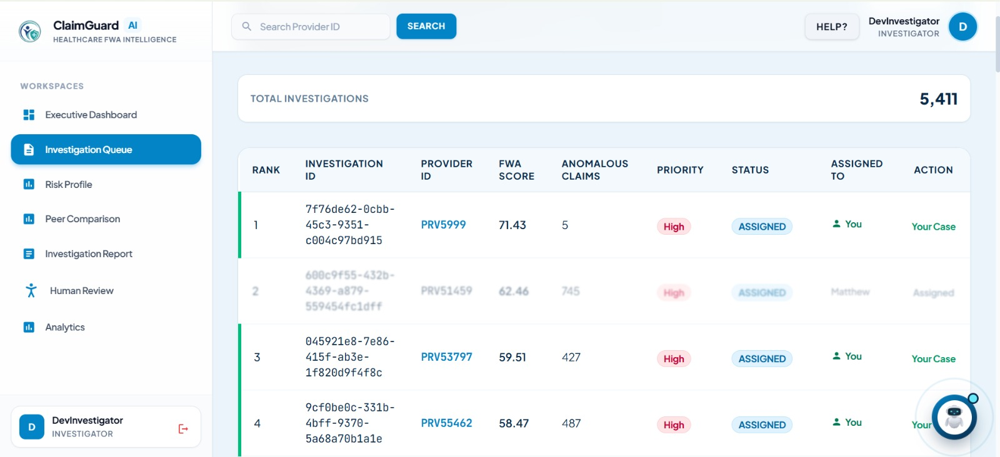

<div align="center">

# 🛡️ ClaimGuard AI

### Healthcare Claims Fraud, Waste & Abuse (FWA) Detection & Prevention Platform

Real-time ML risk scoring · Investigation workflow · Peer comparison analytics · Executive ROI dashboards

[]()
[]()
[]()
[]()
[]()

</div>

---

## Overview

**ClaimGuard AI** is a full-stack platform that helps healthcare payers detect, investigate, and prevent **Fraud, Waste, and Abuse (FWA)** in medical claims. It combines machine learning risk scoring with an end-to-end investigation workflow — from automated anomaly detection all the way to human review, reporting, and executive-level ROI tracking.

The platform serves three distinct user roles:

- **Providers** — register and submit claims
- **Investigators** — work an ML-prioritized investigation queue, review flagged providers, and produce investigation reports
- **Admins** — approve providers/investigators and monitor the system from an executive dashboard

## ✨ Key Features

- **Real-time ML risk scoring** — claims and providers are scored using an `XGBoost` provider-risk model and an `Isolation Forest` anomaly-detection model
- **Investigation queue** — auto-ranked, priority-sorted list of high-risk providers with FWA scores and anomalous claim counts
- **Peer comparison analytics** — benchmark a provider's billing behavior against its peer group to surface outliers
- **Executive dashboard** — portfolio-level KPIs, trends, and ROI analytics for leadership
- **Investigation reports** — generate and export polished PDF investigation reports (`@react-pdf/renderer`)
- **Human-in-the-loop review** — investigators can confirm, escalate, or dismiss ML-flagged cases
- **Role-based auth** — separate JWT-secured login flows for Admins, Investigators, and Providers, with an admin approval workflow for new investigators/providers
- **In-app assistant** — an integrated chatbot widget to help users navigate claims and lookups
- **Geocoding support** — provider location enrichment via the OpenCage API

## 🏗️ Tech Stack

| Layer | Technologies |
|---|---|
| **Frontend** | React 19, TypeScript, Vite, Express (SSR server), Material UI, Tailwind CSS, Recharts, React Router, Framer Motion (`motion`) |
| **Backend** | Python, FastAPI, PyJWT, Uvicorn/Express-compatible ASGI server |
| **Database / Auth** | Supabase (Postgres + Auth) |
| **Machine Learning** | XGBoost (provider risk model), Isolation Forest (claim anomaly detection), pandas/scikit-learn pipelines |
| **Reporting** | `@react-pdf/renderer`, `pdfjs-dist` |
| **Notifications** | SMTP email service (e.g. Gmail SMTP) |
| **Geocoding** | OpenCage Geocoding API |

## 📁 Repository Structure

```
FWA/
├── Frontend/                  # React + Vite + TypeScript client
│   ├── src/
│   │   ├── admin/             # Admin panel & dashboard
│   │   ├── auth/              # Login / registration screens
│   │   ├── components/        # Shared UI, chatbot widget, navigation
│   │   │   └── screens/       # Executive dashboard, investigation queue,
│   │   │                      # peer comparison, risk profile, reports, etc.
│   │   ├── context/           # React context (report data, etc.)
│   │   ├── services/          # API clients (claims, risk, review, auth...)
│   │   └── lib/               # Supabase client
│   └── package.json
│
├── backend/                   # FastAPI service
│   ├── app/
│   │   ├── api/                # Route definitions (auth, claims, risk,
│   │   │                       #  investigations, dashboards, etc.)
│   │   ├── core/                # Config & security (JWT, env)
│   │   ├── schemas/             # Pydantic request/response models
│   │   └── services/            # Business logic, ML scoring, PDF/report
│   │                             #  generation, email, geocoding
│   ├── models/                  # Trained ML models (XGBoost, Isolation Forest)
│   ├── data/                    # Reference/claim datasets used for scoring
│   ├── create_admin.py          # Bootstrap an initial admin user
│   └── import_provider_*.py     # Data import/seeding scripts
│
├── screenshots/                # Product screenshots
└── FWA.ipynb                   # Notebook: model training / experimentation
```

## 🚀 Getting Started

### Prerequisites

- **Node.js** (v18+ recommended) and npm, or [Bun](https://bun.sh)
- **Python** 3.10+
- A **Supabase** project (URL + API key)
- SMTP credentials (for email notifications)
- An **OpenCage** API key (for geocoding, optional but recommended)

### 1. Clone the repository

```bash
git clone https://github.com/ematty246/FWA.git
cd FWA
```

### 2. Backend setup (FastAPI)

```bash
cd backend
python -m venv venv
source venv/bin/activate      # on Windows: venv\Scripts\activate
pip install fastapi uvicorn python-dotenv pyjwt pandas scikit-learn xgboost supabase
```

Create a `.env` file in `backend/` with the following variables:

```env
SUPABASE_URL=your_supabase_url
SUPABASE_KEY=your_supabase_key

JWT_SECRET_KEY=your_jwt_secret
JWT_ALGORITHM=HS256
ACCESS_TOKEN_EXPIRE_MINUTES=30
REFRESH_TOKEN_EXPIRE_DAYS=7

PASSWORD_RESET_EXPIRE_MINUTES=30
FRONTEND_BASE_URL=http://localhost:5173

SMTP_HOST=smtp.gmail.com
SMTP_PORT=587
SMTP_USERNAME=your_email@example.com
SMTP_PASSWORD=your_app_password
SMTP_FROM_EMAIL=your_email@example.com
SMTP_FROM_NAME=ClaimGuard AI

ADMIN_EMAIL=admin@example.com
ADMIN_PASSWORD=change_me

OPENCAGE_API_KEY=your_opencage_api_key
```

Run the API server:

```bash
uvicorn app.main:app --reload
```

The API will be available at `http://localhost:8000`, with interactive docs at `http://localhost:8000/docs`.

> Optional: run `python create_admin.py` and the `import_provider_*.py` scripts to seed an initial admin user and provider/claims reference data.

### 3. Frontend setup (React + Vite)

```bash
cd Frontend
npm install     # or: bun install
```

Set your environment variables (e.g. Supabase keys, API base URL, Gemini key if using the AI Studio chatbot) in a `.env.local` file, then run:

```bash
npm run dev
```

The app will be available at `http://localhost:5173`.

## 🧠 Machine Learning Models

Pretrained models ship in `backend/models/`:

- **`xgboost_provider_model.pkl`** — gradient-boosted model that scores providers on FWA risk
- **`claim_isolation_forest.pkl`** — unsupervised anomaly detector applied at the claim level
- **`provider_fwa_reference.csv`** — reference dataset used for peer benchmarking

Model training and experimentation are documented in [`FWA.ipynb`](./FWA.ipynb).

## 📸 Screenshots

<div align="center">


</div>

See the [`screenshots/`](./screenshots) folder for the full set, including the executive dashboard, risk profile, peer comparison, investigation reports, and human review screens.

## 🗺️ Core Modules

| Module | Description |
|---|---|
| **Executive Dashboard** | Portfolio-wide KPIs, trend charts, and ROI analytics |
| **Investigation Queue** | Ranked list of flagged providers, sortable by FWA score & priority |
| **Risk Profile** | Deep-dive into an individual provider's risk factors |
| **Peer Comparison** | Compares a provider's billing patterns against similar peers |
| **Submission / Claims** | Provider-facing claim submission and history |
| **Human Review** | Investigator workflow to confirm/dismiss ML flags |
| **Investigation Report** | Generates a downloadable PDF report per case |
| **Admin Panel** | Approve providers/investigators, manage users |

## 🤝 Contributing

Contributions, issues, and feature requests are welcome. Feel free to open an issue or submit a pull request.

## 📄 License

No license has been specified for this repository yet. Consider adding a `LICENSE` file to clarify usage rights.
